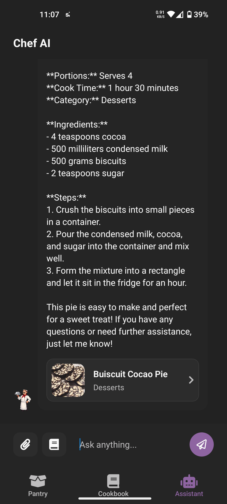
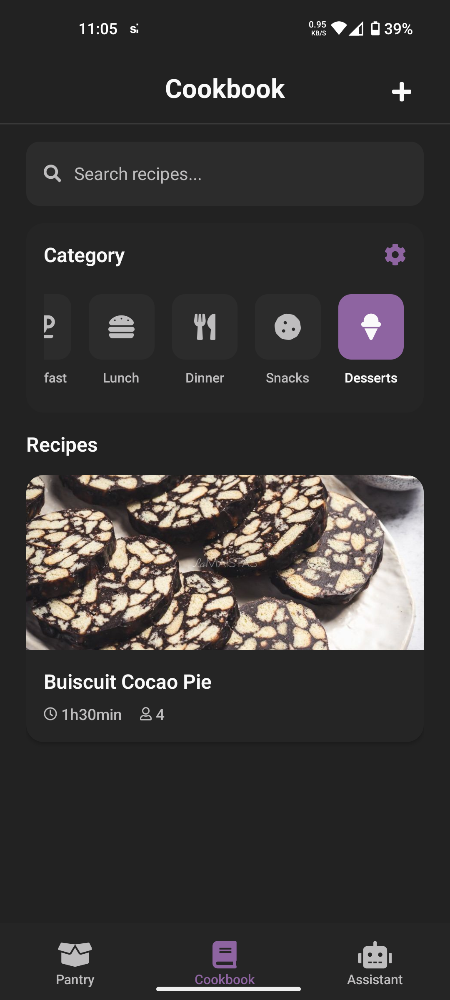
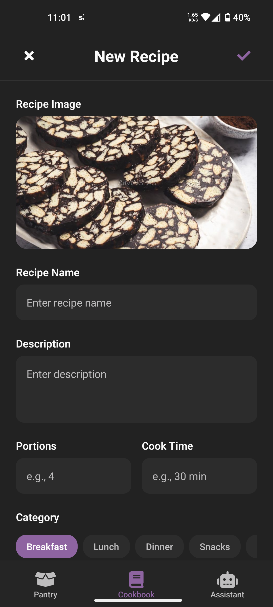

<div align="center">
	
  
# Chef AI

A lightweight cooking companion built with Expo + React Native. Manage recipes and pantry items, plan cooking steps, and browse your cookbook — all in one place.

</div>

## ✨ Features

- 📚 Cookbook: Create, edit, and browse recipes with rich details.
- 🧑‍🍳 Guided steps: Follow structured cooking steps while you cook.
- 🗂️ Categories: Organize recipes by custom categories with icons.
- 🧺 Pantry: Track ingredients you have on hand.
- 🔎 Quick search: Find recipes by title, category, or ingredient.
- 💾 Offline-first: Persists data locally using AsyncStorage.

## 📸 Screenshots

<p>
	
	
	
  
</p>

## 🧱 Tech Stack

- Expo SDK 54 (`expo ~54.0.30`)
- React Native 0.81 (`react-native 0.81.5`)
- React 19 (`react 19.1.0`)
- React Navigation 7 (stack + bottom tabs)
- AsyncStorage for local persistence
- Expo Status Bar, Linear Gradient, Image Picker, Navigation Bar
- Vector Icons via `@expo/vector-icons`

## 🚀 Getting Started

Prerequisites

- Node.js LTS (v18+ recommended)
- Android Emulator or iOS Simulator, or the Expo Go app on a device

Install and run

```bash
# install dependencies
npm install

# start the Expo dev server
npx expo start

# inside the Expo Dev Tools press:
#  - a to launch Android
#  - i to launch iOS (macOS only)
#  - w to launch web
```

Common scripts

```bash
npm run android  # start + open Android
npm run ios      # start + open iOS (macOS only)
npm run web      # start + open web
```

## 📁 Project Structure

```
.
├─ App.js
├─ index.js
├─ app.json
├─ package.json
├─ assets/
│  ├─ chef-ai-assistant.png
│  ├─ chef-ai-cookbook.png
│  ├─ chef-ai-new-recipe.png
│  └─ ...
├─ components/
│  ├─ CategoryItem.jsx
│  ├─ RecipeCard.jsx
│  └─ SearchBar.jsx
├─ constants/
│  ├─ categoryIcons.js
│  └─ theme.js
├─ navigation/
│  ├─ AssistantStack.jsx
│  ├─ CookbookStack.jsx
│  └─ MainNavigator.jsx
├─ screens/
│  ├─ AssistantScreen.jsx
│  ├─ CookbookScreen.jsx
│  ├─ CookingStepsScreen.jsx
│  ├─ NewRecipeScreen.jsx
│  ├─ EditRecipeScreen.jsx
│  ├─ PantryScreen.jsx
│  └─ RecipeDetails.jsx
├─ contexts/
├─ utils/
│  ├─ categoryStorage.js
│  ├─ pantryStorage.js
│  └─ recipeStorage.js
```

## 🧩 Configuration

- The project includes `react-native-dotenv`. If you introduce configuration values later, you can load them from a `.env` file and import with `@env`.
- No external services are required for local usage; everything runs offline via AsyncStorage.

## 📦 Building (optional)

This repo includes an `eas.json`. If you use EAS Build:

```bash
npx eas login                # once, if needed
npx eas build -p android     # Android build
npx eas build -p ios         # iOS build (requires macOS + Apple account)
```

For local device testing without EAS, you can also use `expo run:android` or `expo run:ios` to create native projects.

## 🔧 Troubleshooting

- If the dev server behaves unexpectedly, clear the cache:

	```bash
	npx expo start --clear
	```

- If images do not appear, confirm the paths match the files under `assets/`.

## 📝 Notes

- This app stores all data locally on the device. Clearing app data or uninstalling will remove saved recipes and pantry items.

---

Made with ❤️ using Expo + React Native.
